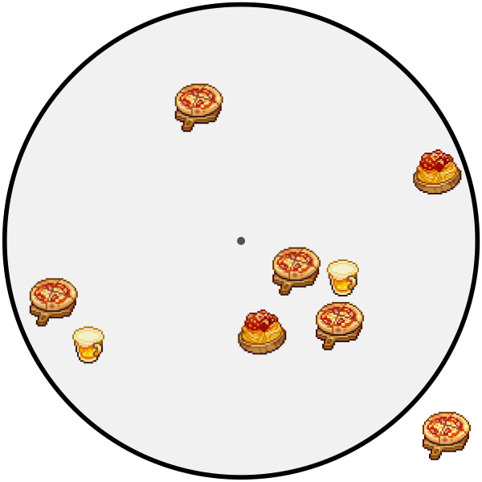
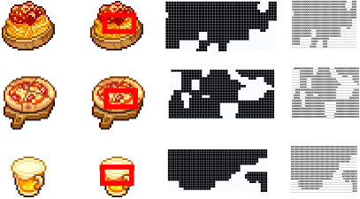

## Tutorial

Assume the following is a snapshot of game and we want to figure out how GraphicSearch can help our script make determinations about what is going on 



<br>
We'll use the followng capture regions. It's very important to capture the smallest region possible, while also being unique to the graphic so it doesn't match other similar things.



These GraphicSearch queries should match many, but probably not all 16:9 ratio screens

```autohotkey
spaghettiGraphic :=  "|<Spaghetti>#153@0.61$44.Dzzzzzy3zzzzzzVzzzzzzszzzzzzkDzzzzzw3zzzzzz0zzzzzU0Dzszzs03zyDzy00zzXzzU0Dk7zk003w1ks003z0QC000k073U0003zks07s0zwC01z8"
pizzaGraphic :=     "|<Pizza>#391@0.61$41.TzXyDzy3z7wDzw7yTwDzsDzzs3XkSDzy07UwTzy071szzz023lzzs00zzzzU0tlzzz03rVszy07j7zzw0zzDzzzzzyTzUDzzwzz0Tzzzzy0zzzzzw1zzzzzs7zzzzzsDzz"
beerGraphic :=      "|<Beer>#418@0.61$44.zzzzzzzzzzzzzzzzzzzzzzzzzzzzzzzzzzzz3zzzzzzkzzzzzzsDzzzzw03zzzzz00zzzzzk0DzzzzkTzzzzzkDzzzzzw3zzzzzy0Tw7zzU03j1zzs001kTzy000Q1zy00070000001s"
```

<br>
If we want to search for all the pizzas we can perform the following to msgbox the x,y location of each match

```autohotkey
oGraphicSearch := new graphicsearch()
resultObj := oGraphicSearch.search(pizzaGraphic)

if (resultObj) {
    loop, % resultObj.Count() {
        msgbox, % "x: " result[A_Index].x ", y: " result[A_Index].y
    }
}
```

<br>
If we wanted to search for two (or more) items in one search that can be accomplished by joining both queries into one long string and performing the same search

```autohotkey
oGraphicSearch := new graphicsearch()
allQueries := pizzaGraphic beerGraphic 
resultObj := oGraphicSearch.search(allQueries)

if (resultObj) {
    loop, % resultObj.Count() {
        msgbox, % "x: " resultObj[A_Index].x ", y: " resultObj[A_Index].y
    }
}
```


<br>
There may be things we want to search for repeatedly but don't want to juggle arguments constantly, you can create instances of GraphicSearch that are responsible for finding individual graphics.

`.searchAgain` is a method that performs the same search with the arguments supplied the last time `.search` was used. Lets create a pizza GraphicSearch and a beer GraphicSearch. When they've both found 

```autohotkey
oPizzaSearch := new graphicsearch()
oBeerSearch := new graphicsearch()
oPizzaSearch.search(pizzaGraphic)
oBeerSearch.search(oBeerSearch)

foundBothGate := false
while (foundBothGate != true) {
    resultPizzaObj := oPizzaSearch.searchAgain()
    resultBeerObj := oBeerSearch.searchAgain()
    if (resultPizzaObj && resultBeerObj) {
        foundBothGate := true
    }
}
```

Since we're not doing anything with the result objects we can simplify the code even further. GraphicSearch can fit comfortably in logic code because it doesn't require many arguments

```autohotkey
foundBothGate := false
while (foundBothGate != true) {
    if (oPizzaSearch.searchAgain() && oBeerSearch.searchAgain()) {
        msgbox, % "Found both Pizza and Beer!"
        foundBothGate := true
    }
}
```

<br>
Let's imagine we want to click the pizza closet to the center, `.sortDistance` will sort a resultsObject by proximity to an x,y coord. A real :smart: app might even GraphicSearch for the center, but let's pretend we already know it's at 300, 300

> [!Note]
> Graphicsearch doesn't mutate arguments it's given, notice that the sorted and unsorted ResultObjects are different in this example.

```autohotkey
oGraphicSearch := new graphicsearch()

resultObj := oGraphicSearch.search(pizzaGraphic)
if (resultObj) {
    sortedResults := oGraphicSearch.sortDistance(resultObj, 300, 300)
    loop, % sortedResults.Count() {
        msgbox, % "x: " sortedResults[A_Index].x ", y: " sortedResults[A_Index].y
    }
}
```

`.sortDistance` adds a property "distance" to each element in the ResultObject. That may be useful for calculating how close things are to each other. Let's msgbox on any pizza's found outside the circle. We'll perform the check `if (sortedResults[A_Index].distance > 350)` which will return true for anything greater than the raduis of the circle (350ish)

```autohotkey
oGraphicSearch := new graphicsearch()

resultObj := oGraphicSearch.search(pizzaGraphic)
if (resultObj) {
    sortedResults := oGraphicSearch.sortDistance(resultObj)
    loop, % sortedResults.Count() {
        if (sortedResults[A_Index].distance > 350) {
            msgbox, % "x: " sortedResults[A_Index].x ", y: " sortedResults[A_Index].y " is outside the circle"
        }
    }
}
```

<!-- sorting external -->
<!-- ```autohotkey
oGraphicSearch := new graphicsearch()
resultObj := oGraphicSearch.search(pizzaGraphic, {})

if (resultObj) {
    totalFound := resultObj.Count()
    
    ; find and save distance for each item
    loop, % result.Count() {
        result[A_Index].distance := A.round(fn_PythagoreanTheorem(Point.x - result[A_Index].x, Point.y - result[A_Index].y))
    }
    ; sort the distance to Point
    sortedCoords := A.sortby(result, "distance")
    sortedCoords := A.sortby(sortedCoords, {id: "Spaghetti"})
    msgbox, % A.printObj(sortedCoords)

    ; move mouse to the closest coord to Point
    CoordMode, Mouse
    ; move mouse to the rest of the coords
    for i, obj in sortedCoords {
        if (obj.distance < 600) {
            Mousemove, % obj.x ,obj.y
            sleep, 300
        }
    }
}
``` -->
